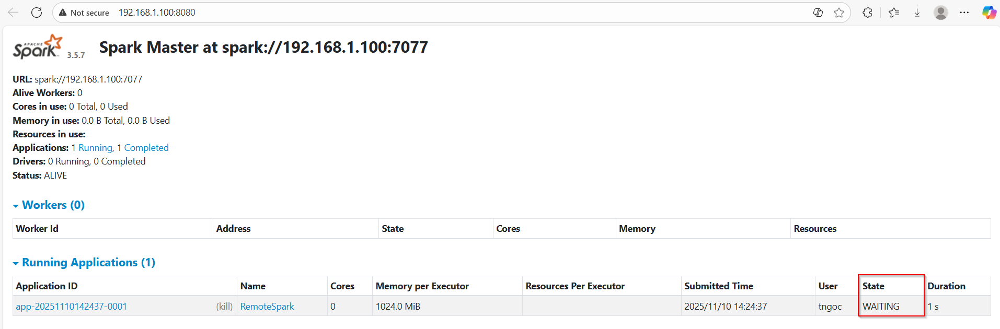
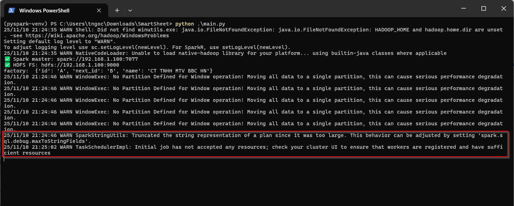

# Hadoop-on-Linux
How to install Hadoop on Linux Server

If you have only one local Linux machine, you’ll want a pseudo-distributed (standalone) Hadoop + Spark setup
That means:
- All Hadoop daemons (NameNode, DataNode, ResourceManager, NodeManager) run on your single machine.
- Spark Master and Worker also run on the same host.
- You can still simulate distributed processing, replication, etc. — but without multiple servers.

# Steps detail
## Step 1: Install Java and basic tools
```bash
sudo apt update && sudo apt install -y openjdk-11-jdk ssh rsync curl wget vim
java -version
```
## Step 2: Create a Hadoop user
```bash
sudo adduser hduser
sudo usermod -aG sudo hduser
su - hduser
```

> [!IMPORTANT]  
> After creating the Hadoop user  
> => You’ll stay in the hadoop user (`hduser` in this case) shell for all remaining steps.

## Step 3: Setup passwordless SSH (Hadoop requirement)
```bash
ssh-keygen -t rsa -b 4096 -f ~/.ssh/id_rsa -N ""
cat ~/.ssh/id_rsa.pub >> ~/.ssh/authorized_keys
chmod 700 ~/.ssh
chmod 600 ~/.ssh/authorized_keys

# test
ssh localhost
```

## Step 4: Install Hadoop
```bash
cd ~
wget https://downloads.apache.org/hadoop/common/hadoop-3.4.0/hadoop-3.4.0.tar.gz
tar -xzf hadoop-3.4.0.tar.gz
mv hadoop-3.4.0 ~/hadoop
```

Add to your ~/.bashrc:
```bash
export HADOOP_HOME=$HOME/hadoop
export HADOOP_CONF_DIR=$HADOOP_HOME/etc/hadoop
export HADOOP_MAPRED_HOME=$HADOOP_HOME
export HADOOP_COMMON_HOME=$HADOOP_HOME
export HADOOP_HDFS_HOME=$HADOOP_HOME
export YARN_HOME=$HADOOP_HOME
export JAVA_HOME=/usr/lib/jvm/java-11-openjdk-amd64
export PATH=$PATH:$HADOOP_HOME/bin:$HADOOP_HOME/sbin
```

Then apply the change
```bash
source ~/.bashrc
```

## Step 5: Configure Hadoop (single node)
### Edit the following files in `$HADOOP_HOME/etc/hadoop`:

1. `hadoop-env.sh`
```bash
export JAVA_HOME=/usr/lib/jvm/java-11-openjdk-amd64
```
2. `core-site.xml`
```xml
<configuration>
  <property>
    <name>fs.defaultFS</name>
    <value>hdfs://localhost:9000</value>
  </property>
</configuration>
```
3. `hdfs-site.xml`
```xml
<configuration>
  <property>
    <name>dfs.replication</name>
    <value>1</value>
  </property>
  <property>
    <name>dfs.namenode.name.dir</name>
    <value>file:///home/hadoop/hdfs/namenode</value>
  </property>
  <property>
    <name>dfs.datanode.data.dir</name>
    <value>file:///home/hadoop/hdfs/datanode</value>
  </property>
</configuration>
```
4. `mapred-site.xml`
```bash
cp mapred-site.xml.template mapred-site.xml
```
And update it
```xml
<configuration>
  <property>
    <name>mapreduce.framework.name</name>
    <value>yarn</value>
  </property>
</configuration>
```
5. `yarn-site.xml`
```xml
<configuration>
  <property>
    <name>yarn.nodemanager.aux-services</name>
    <value>mapreduce_shuffle</value>
  </property>
  <property>
    <name>yarn.resourcemanager.hostname</name>
    <value>localhost</value>
  </property>
</configuration>
```

### And create some important directories
```bash
# Check what HDFS is configured to use (quick sanity)
grep -E "dfs.namenode.name.dir|dfs.datanode.data.dir" $HADOOP_HOME/etc/hadoop/hdfs-site.xml -n || true

# Create the directories and set ownership/permissions
# create dirs that NameNode/DataNode expect
sudo mkdir -p /home/hadoop/hdfs/namenode
sudo mkdir -p /home/hadoop/hdfs/datanode
# set hduser as owner (replace hduser with your username if different)
sudo chown -R hduser:hduser /home/hadoop/hdfs
# tighten permissions
sudo chmod -R 700 /home/hadoop/hdfs

# Quick check
ls -ld /home/hadoop/hdfs
ls -ld /home/hadoop/hdfs/namenode
df -h /home  # => check free disk space for NameNode

# Kill any leftover daemons & remove stale PID files
pkill -f NameNode || true
pkill -f DataNode || true
pkill -f SecondaryNameNode || true
rm -f /tmp/hadoop-$(whoami)-*.pid
```

## Step 6: Format and start Hadoop
```bash
hdfs namenode -format
start-dfs.sh
start-yarn.sh

# Then check the running processes
jps
```

> [!IMPORTANT]
> The output of `hdfs namenode -format` command should look like
> ```bash
> 2025-11-10 13:05:08,811 INFO namenode.FSDirectory: ACLs enabled? true
> 2025-11-10 13:05:08,811 INFO namenode.FSDirectory: POSIX ACL inheritance enabled? true
> 2025-11-10 13:05:08,812 INFO namenode.FSDirectory: XAttrs enabled? true
> 2025-11-10 13:05:08,812 INFO namenode.NameNode: Caching file names occurring more than 10 times
> 2025-11-10 13:05:08,821 INFO snapshot.SnapshotManager: Loaded config captureOpenFiles: false, skipCaptureAccessTimeOnlyChange: false, snapshotDiffAllowSnapRootDescendant: true, maxSnapshotFSLimit: 65536, maxSnapshotLimit: 65536
> 2025-11-10 13:05:08,821 INFO snapshot.SnapshotManager: dfs.namenode.snapshot.deletion.ordered = false
> 2025-11-10 13:05:08,823 INFO snapshot.SnapshotManager: SkipList is disabled
> 2025-11-10 13:05:08,830 INFO util.GSet: Computing capacity for map cachedBlocks
> 2025-11-10 13:05:08,830 INFO util.GSet: VM type       = 64-bit
> 2025-11-10 13:05:08,831 INFO util.GSet: 0.25% max memory 956 MB = 2.4 MB
> 2025-11-10 13:05:08,831 INFO util.GSet: capacity      = 2^18 = 262144 entries
> 2025-11-10 13:05:08,844 INFO metrics.TopMetrics: NNTop conf: dfs.namenode.top.window.num.buckets = 10
> 2025-11-10 13:05:08,845 INFO metrics.TopMetrics: NNTop conf: dfs.namenode.top.num.users = 10
> 2025-11-10 13:05:08,845 INFO metrics.TopMetrics: NNTop conf: dfs.namenode.top.windows.minutes = 1,5,25
> 2025-11-10 13:05:08,851 INFO namenode.FSNamesystem: Retry cache on namenode is enabled
> 2025-11-10 13:05:08,851 INFO namenode.FSNamesystem: Retry cache will use 0.03 of total heap and retry cache entry expiry time is 600000 millis
> 2025-11-10 13:05:08,854 INFO util.GSet: Computing capacity for map NameNodeRetryCache
> 2025-11-10 13:05:08,854 INFO util.GSet: VM type       = 64-bit
> 2025-11-10 13:05:08,855 INFO util.GSet: 0.029999999329447746% max memory 956 MB = 293.7 KB
> 2025-11-10 13:05:08,855 INFO util.GSet: capacity      = 2^15 = 32768 entries
> 2025-11-10 13:05:08,902 INFO namenode.FSImage: Allocated new BlockPoolId: BP-774335492-127.0.1.1-1762779908893
> 2025-11-10 13:05:08,929 INFO common.Storage: Storage directory /home/hadoop/hdfs/namenode has been successfully formatted.
> 2025-11-10 13:05:08,988 INFO namenode.FSImageFormatProtobuf: Saving image file /home/hadoop/hdfs/namenode/current/fsimage.ckpt_0000000000000000000 using no compression
> 2025-11-10 13:05:09,120 INFO namenode.FSImageFormatProtobuf: Image file /home/hadoop/hdfs/namenode/current/fsimage.ckpt_0000000000000000000 of size 401 bytes saved in 0 seconds .
> 2025-11-10 13:05:09,140 INFO namenode.NNStorageRetentionManager: Going to retain 1 images with txid >= 0
> 2025-11-10 13:05:09,150 INFO blockmanagement.DatanodeManager: Slow peers collection thread shutdown
> 2025-11-10 13:05:09,184 INFO namenode.FSNamesystem: Stopping services started for active state
> 2025-11-10 13:05:09,185 INFO namenode.FSNamesystem: Stopping services started for standby state
> 2025-11-10 13:05:09,189 INFO namenode.FSImage: FSImageSaver clean checkpoint: txid=0 when meet shutdown.
> 2025-11-10 13:05:09,192 INFO namenode.NameNode: SHUTDOWN_MSG:
> /************************************************************
> SHUTDOWN_MSG: Shutting down NameNode at ngochieutran/127.0.1.1
> ************************************************************/
> ```
>
> The output of `start-dfs.sh` command should look like
> ```bash
> Starting namenodes on [localhost]
> Starting datanodes
> Starting secondary namenodes
> ```
> 

## Step 7: Verify Hadoop
```bash
hdfs dfs -mkdir -p /user/hduser
hdfs dfs -put $HADOOP_HOME/etc/hadoop/core-site.xml /user/hduser/
hdfs dfs -ls /user/hduser
hdfs dfs -cat /user/hduser/core-site.xml
```

## Step 8: Install Spark (standalone)
```bash
cd ~
wget https://downloads.apache.org/spark/spark-3.5.7/spark-3.5.7-bin-hadoop3.tgz
tar -xzf spark-3.5.7-bin-hadoop3.tgz
mv spark-3.5.7-bin-hadoop3 spark
```

And add Spark to `.bashrc`:
```bash
export SPARK_HOME=$HOME/spark
export PATH=$PATH:$SPARK_HOME/bin:$SPARK_HOME/sbin
export HADOOP_CONF_DIR=$HADOOP_HOME/etc/hadoop
```

Then apply the change
```bash
source ~/.bashrc
```

## Step 9: Start Spark standalone cluster
```bash
start-master.sh
start-worker.sh spark://localhost:7077

# Verify Spark shell
spark-shell --master spark://localhost:7077
```

## Step 10: Test Spark Job
```bash
$SPARK_HOME/bin/spark-submit --master spark://localhost:7077 \
  --class org.apache.spark.examples.SparkPi \
  $SPARK_HOME/examples/jars/spark-examples_2.12-3.5.0.jar 10
```

## Step 11: Configure Spark master to bind externally
1. Edit `conf/spark-env.sh` on Linux (`$SPARK_HOME/conf/spark-env.sh`):
```bash
export SPARK_MASTER_HOST=192.168.1.100
export SPARK_MASTER_PORT=7077
export SPARK_MASTER_WEBUI_PORT=8080
```

Then restart the master
```bash
$SPARK_HOME/sbin/stop-master.sh
$SPARK_HOME/sbin/start-master.sh
```
Check the log, should see
```bash
Starting Spark master at spark://192.168.1.100:7077
Web UI available at http://192.168.1.100:8080
```
2. Make sure Linux firewall allows port 7077 and 8080
```bash
sudo ufw allow 7077
sudo ufw allow 8080

# Verify
sudo netstat -tulnp | grep 7077
# The output
# tcp6       0      0 192.168.1.100:7077     :::*     LISTEN      12345/java
```

> [!IMPORTANT]
> The pyspark version must be compatible between server and code
> To ensure this, run the command `$SPARK_HOME/bin/spark-submit --version` then update the pyspark version

# Check UI
NameNode UI: `http://localhost:9870`
YARN ResourceManager: `http://localhost:8088`
Spark Master: `http://localhost:8080`
Spark Worker: `http://localhost:8081`


# Stop
## 1. Stop Spark Standalone Cluster
```bash
# All workers
$SPARK_HOME/sbin/stop-worker.sh
# Master
$SPARK_HOME/sbin/stop-master.sh

# Or stop all at once (if you used `start-all.sh`)
$SPARK_HOME/sbin/stop-all.sh
```
## 2. Stop HDFS (Hadoop)
```bash
$HADOOP_HOME/sbin/stop-dfs.sh
$HADOOP_HOME/sbin/stop-yarn.sh
```

## 3. Kill leftover java processes
```bash
echo "Killing leftover Java processes (careful!)..."
jps | awk '{print $1}' | xargs -r kill -9
```


# Troubleshoot
## 1. TaskSchedulerImpl: Initial job has not accepted any resources;



=> Solution
1. Start a worker on your Linux node
=> This will register a worker with the master.
```bash
$SPARK_HOME/sbin/start-worker.sh spark://192.168.1.100:7077

# Or
$SPARK_HOME/sbin/start-worker.sh -c 4 -m 4G spark://192.168.1.100:7077
# -c 4 → 4 CPU cores
# -m 4G → 4 GB memory
```

2. Add to `~/.bashrc` or create a systemd service
=> This ensures the worker is always available.
```bash
$SPARK_HOME/sbin/start-worker.sh spark://192.168.1.100:7077
```
